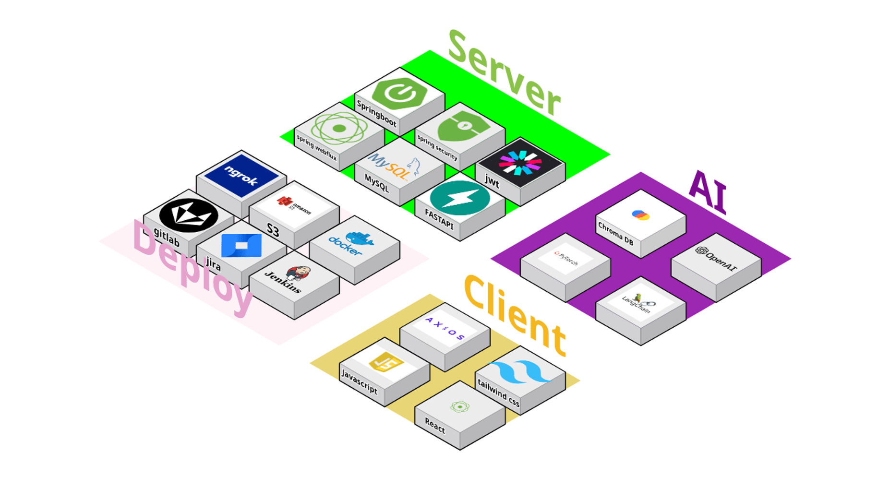

`# White-Box - 화상 회의를 이용한 코딩 스터디 최적화 프로젝트

## 목차
### 1. [프로젝트 개요](#1-프로젝트-개요)
### 2. [기술 스택](#2-기술-스택)
### 3. [아키텍처 & ERD](#3-아키텍처--erd)
### 4. [서비스 기능 소개](#4-서비스-기능-소개)
### 5. [프로젝트 회고](#5-프로젝트-회고)

## 1. 프로젝트 개요
[White-Box](https://j11a104.p.ssafy.io/)는 교통사고 분쟁 해결을 위한 AI 사고판독 서비스를 제공하는 사이트입니다. 

###  📅 개발 기간
| 개발기간 | 2024.08.26 ~ 2024.10.11 (7주) |
|-|-|

###  👥 팀원 소개
| 팀원   | 역할        | 개발 내용                                                    |
|------|-----------|----------------------------------------------------------|
| 신우호 | 팀장, AI 리드    | 작성요망 |
| 정호성 | FE 리드     | 하하 |
| 민  호 | 작성요망 | 작성요망   |
| 차재훈 | 작성요망      | 작성요망              |
| 송인범 | 작성요망        | 작성요망          |
| 김근욱 | 작성요망        | 작성요망 |

### 💡 기획 배경
다음과 같은 문제 상황들을 개선하고자 했습니다.

1. 연간 100만 건 이상의 교통사고 발생건수가 꾸준히 증가하는 추세를 보이고 있습니다.
2. 교통사고로 인한 분쟁 심의 건수가 매년 가파르게 늘어나고 있습니다.
3. 분쟁 심의 및 소송에 소요되는 시간이 길고, 절차가 복잡합니다.

### 💡 기대효과 및 차별점
1. 기대효과
    - 교통사고 과실비율을 산정하기 위해 소요되는 시간과 비용 절감
    - 보험사 및 법률 전문 기관의 업무 부담 완화
    - 교통사고 통계 자료로서 활용가능
2. 차별점
    - 어디에도 없던 새로운 서비스
    - 신속하고 편리하게 사고 과실을 확인할 수 있음
    - RAG기반으로 풍부하고 이해하기 쉬운 산정 근거 제공 및 중립적인 판단 제공

## 2. 기술 스택

  Infra
  

    
    
    
    
  

  BE & DB
  

     
    
    
    
  

  FE
  

    
    
    
    
  

  AI
  

    
    
  

## 3. 아키텍처 & ERD

## 4. 서비스 기능 소개
#### 1. AI
    1. RAG(Retrieval-Augmented Generation)
        - 대법원 판례를 ~~~했어요 
        - 그걸 벡터 DB화 하여 ~~~~~~했어용가리어카센터미널
    2. CasCade R-CNN
    3. SlowFast ResNet50
    4. DeepFace

#### 2. 투표게시판
    1. 투표를 할 수 잇단단다

#### 3. 정보게시판
    1. 정보를 볼 수  잇단단다

## 5. 프로젝트 회고
|    |             | |
|--------|--------------------|-|
| 신우호    | 느낀점        | ㅋ|
|           | 아쉬운점      | ㅋ|
| 정호성    | 느낀점        | ㅋ|
|           | 아쉬운점      | ㅋ|
| 민호      | 느낀점        | ㅋ|
|           | 아쉬운점      | ㅋ|
| 차재훈    | 느낀점        | ㅋ|
|           | 아쉬운점      | ㅋ|
| 송인범    | 느낀점        | ㅋ|
|           | 아쉬운점      | ㅋ|
| 김근욱    | 느낀점        | ㅋ|
|           | 아쉬운점      | ㅋ|
|
