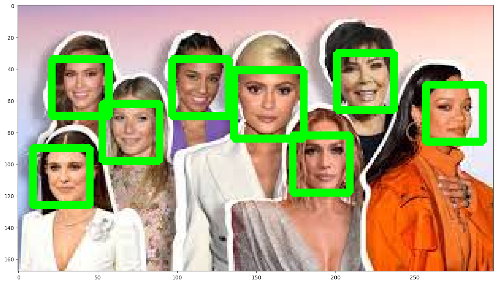

# 2024. 08. 27 화 TIL


## 얼굴을 인식하고, 구별하기.
google colab을 이용하여 얼굴을 탐지하고, 얼굴의 유사도를 비교해봤다.

구글 드라이브의 폴더를 불러오기
```python
from google.colab import drive
drive.mount('/gdrive')
%cd /gdrive
```

### 얼굴 찾기

얼굴을 인식하는 모듈을 받아주고 필요한 모듈들을 import 해준다.
```bash
pip install face_recognition
```
```python
import cv2, os
import face_recognition as fr
from IPython.display import Image, display
from matplotlib import pyplot as plt
```

사람이 여러명 나오는 사진을 한장 받아서 img01.jpg로 저장하고,

사람의 얼굴을 찾아서 찾은 얼굴의 주위로 박스를 치도록 만들기

```python
img_path = '/gdrive/MyDrive/Colab Notebooks/img01.jpg'
image = fr.load_image_file(img_path)
face_locations = fr.face_locations(image)
for (top, right, bottom, left) in face_locations:
    cv2.rectangle(image, (left, top), (right, bottom), (0,255,0), 3)
plt.rcParams['figure.figsize'] = (16,16)
plt.imshow(image)
plt.show()
```



### 얼굴 유사도 분석
네 개의 파일 - 같은 인물 두 사진과 다른 인물 두 사진을 준비했다.
우선 사진에서 얼굴을 찾아서, face_list에 저장하고

```python
plt.rcParams["figure.figsize"] = (1,1)

person_list = []
person_list.append(cv2.imread("/gdrive/MyDrive/Colab Notebooks/haerin.jpg"))
person_list.append(cv2.imread("/gdrive/MyDrive/Colab Notebooks/hanni.jpg"))
person_list.append(cv2.imread("/gdrive/MyDrive/Colab Notebooks/minji01.jpg"))

face_list = []

for person in person_list:
    top, right, bottom, left = fr.face_locations(person)[0]
    face_image = person[top:bottom, left:right]
    face_list.append(face_image)
```

찾으려고 하는 이미지의 파일을 따로 저장하기
```python
unknown = fr.load_image_file("/gdrive/MyDrive/Colab Notebooks/minji02.jpg")
top, right, bottom, left = fr.face_locations(unknown)[0]
unknown_face = unknown[top:bottom, left:right]
plt.title('unknown')
plt.imshow(unknown_face)
plt.show()
```

찾으려는 이미지파일을 수치화하여 원래의 얼굴들과 비교해서 유사도를 찾기
```python
unknown_face = cv2.imread('/gdrive/MyDrive/Colab Notebooks/minji02.jpg')
encoding_unknown = fr.face_encodings(unknown_face)
for face in person_list:
    encoding_known = fr.face_encodings(face)
    distance = fr.face_distance(encoding_known, encoding_unknown[0])
    plt.title("distance : " + str(distance))
    plt.imshow(face)
    plt.show()
```